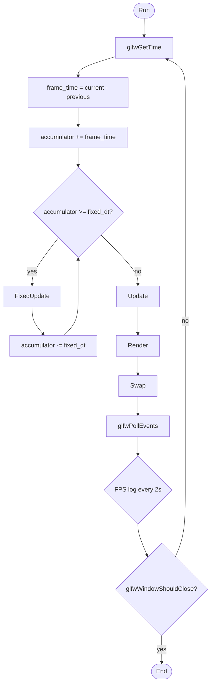
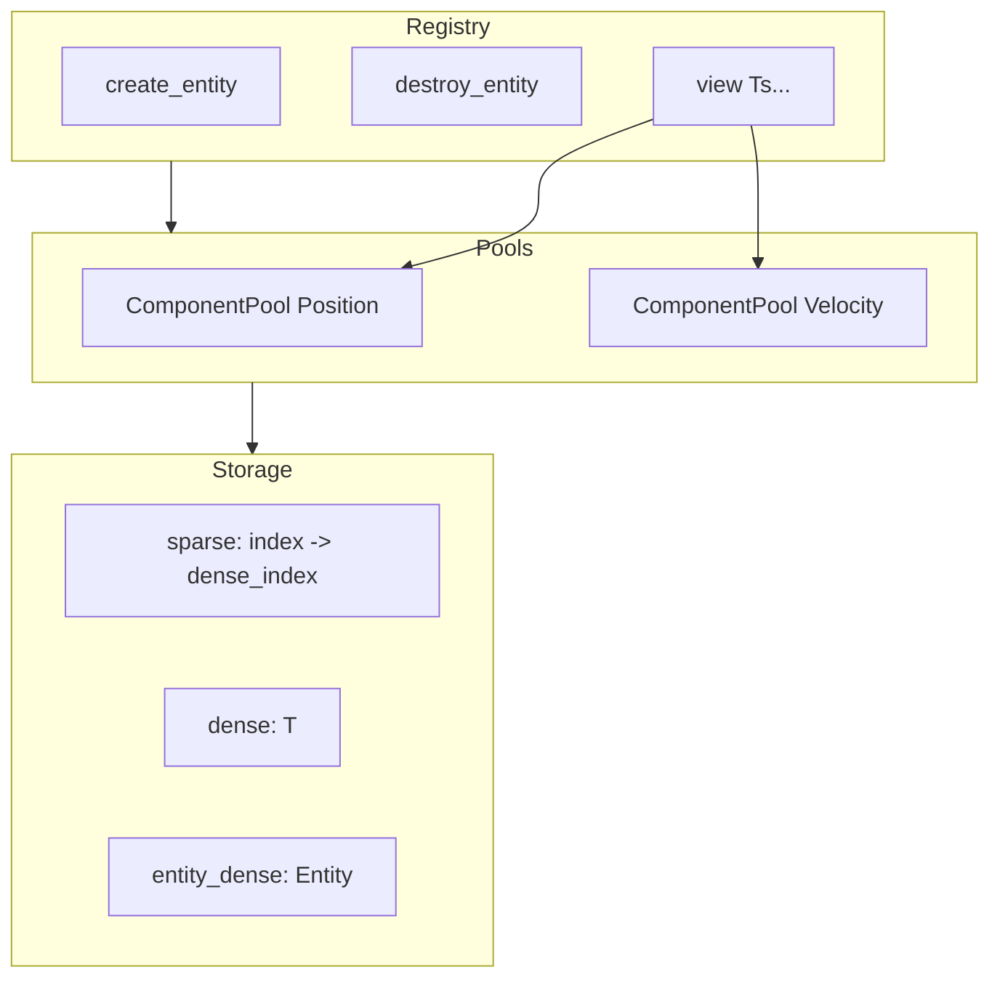
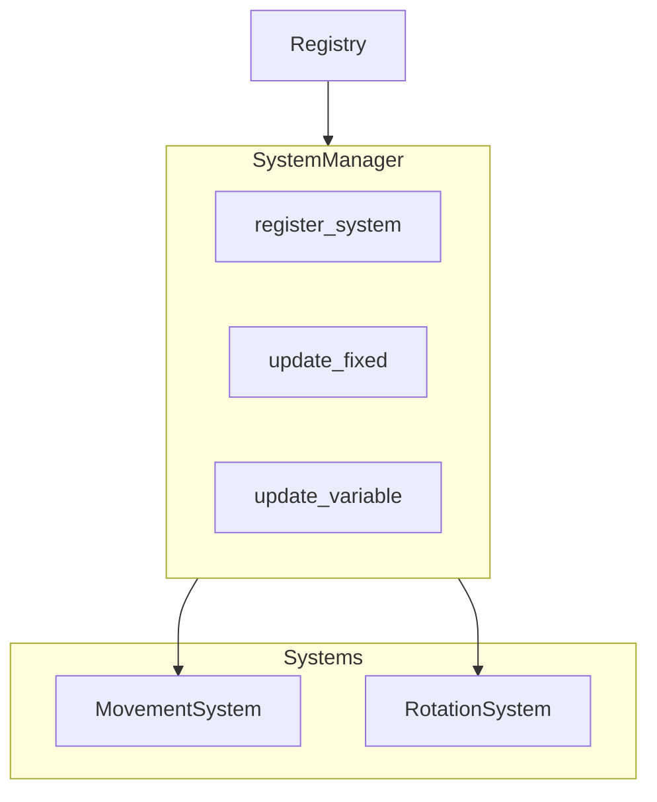
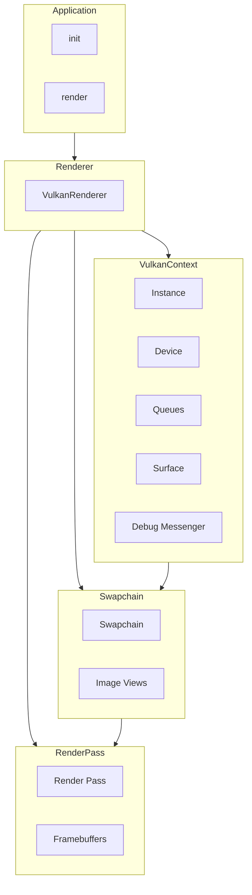
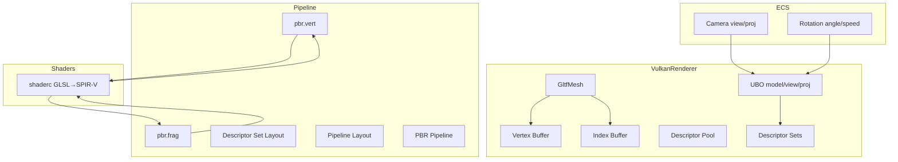
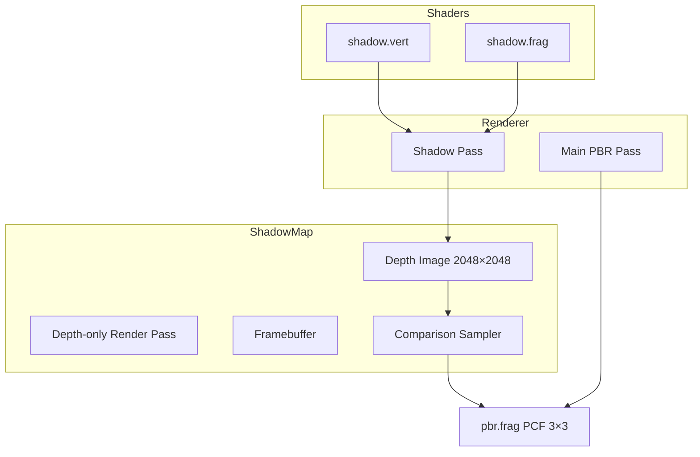
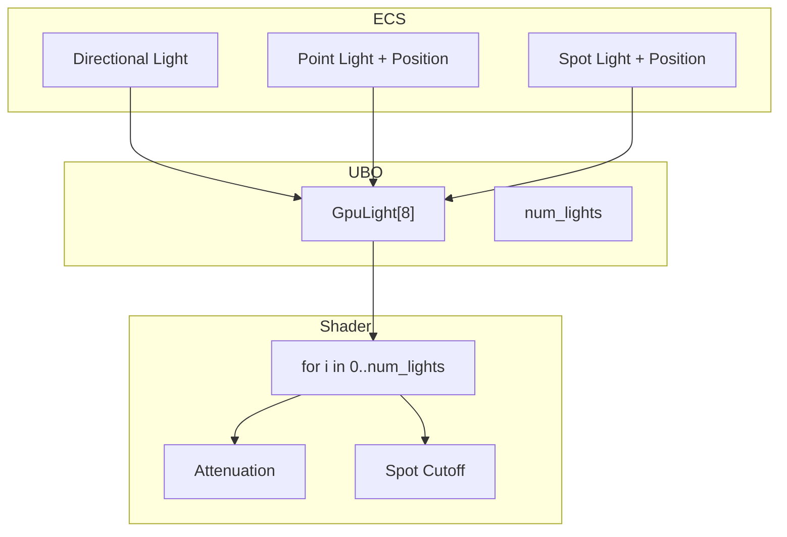
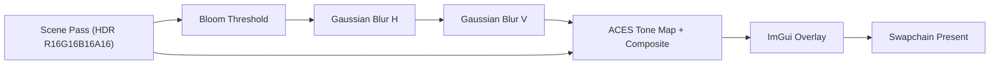
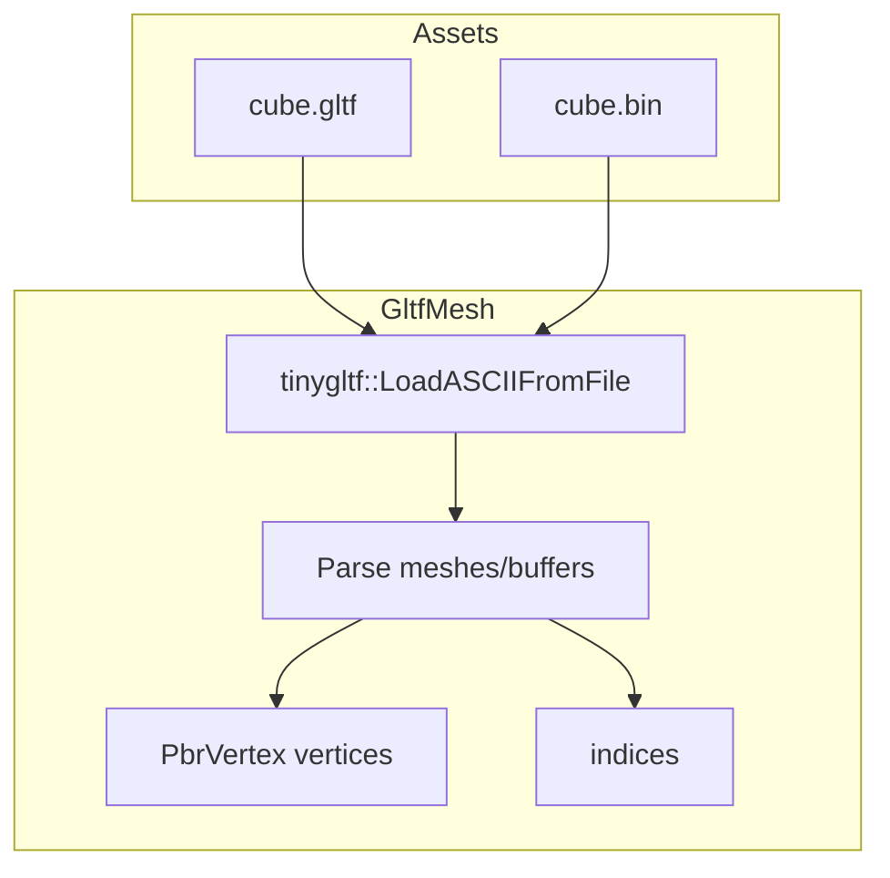
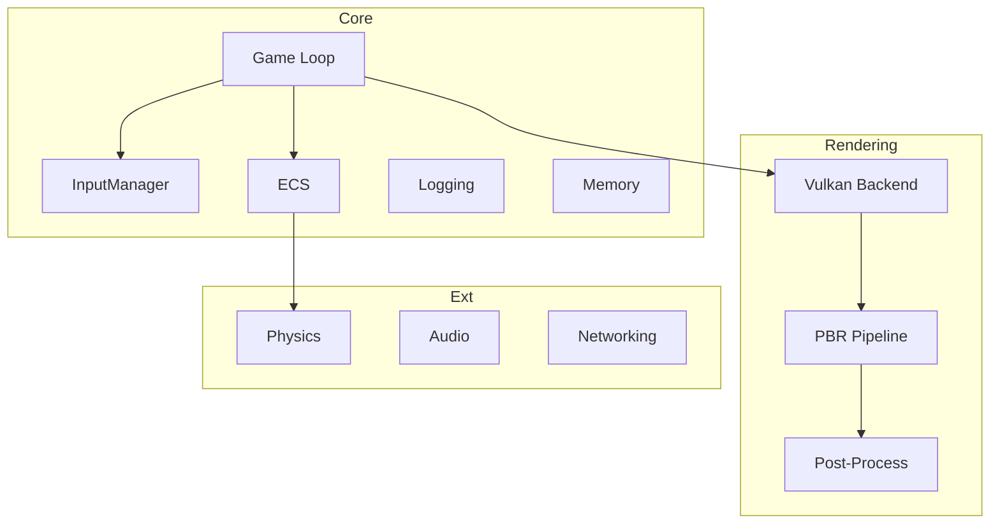

# Kenga Engine — Архитектура

> High-level обзор. Обновляется после крупных изменений.

## Текущее состояние

**Фаза 3 завершена:** Core + ECS + Vulkan + PBR + glTF + Shadow Mapping + Camera Input + Depth Buffer + UV Textures + Multi-Light (Directional/Point/Spot) + Post-Processing (HDR + Bloom + ACES Tone Mapping) + ImGui Debug UI.

**Фаза 4 (Physics):** Bullet3 — rigid bodies, collisions (manifolds → audio + GPU/CPU particles), ECS sync (Position/Orientation), hinge constraints (btHingeConstraint). Particle system: CPU + GPU, collision sparks.

**Arena One / M2:** волны врагов: GameSystem (current_wave, waves_total, победа после всех волн), Application::spawn_wave(wave_num), при очистке волны в update() спавнится следующая; HUD с Wave X / Y.

**Улучшения v0.1+:**
- **Runtime конфигурация** (`Settings`): settings.json для window, rendering, audio, physics
- **Shader кэширование** (`ShaderCompiler`): GLSL→SPIR-V с on-disk кэшированием (.spv)
- **Безопасность**: все `std::exit(1)` заменены на exceptions, Lua sandboxing (без io/os), bounds-checked JSON
- **Версионирование**: version + git hash инжектируются при сборке
- **CI/CD**: GitHub Actions workflow для Windows (Debug + Release)
- **Тесты**: 28 unit-тестов (ECS, Physics, JSON, Serialization, Prefabs)

## Main Loop (Gaffer on Games pattern)

## ECS (Phase 2.2)

- **Entity:** uint32_t, generational (low 20 bit = index, high 12 bit = version)
- **ComponentPool&lt;T&gt;:** sparse-set (sparse + dense + entity_dense)
- **Registry:** create/destroy, add/remove/get/has, view&lt;Ts...&gt;

## SystemManager (Phase 2.3)

- **ISystem:** fixed_update, variable_update
- **SystemManager:** register_system&lt;T&gt;, update_fixed, update_variable

## Rendering (Phase 3.1)

- **VulkanContext:** instance, physical/logical device, queues, surface, validation
- **Swapchain:** B8G8R8A8_SRGB, recreation on resize
- **RenderPass:** single subpass, clear color (0.1, 0.1, 0.2)

### PBR Pipeline (Phase 3.3)

- **PbrVertex:** glm::vec3 pos, glm::vec3 normal, glm::vec2 uv
- **Pipeline:** pbr.vert / pbr.frag (metallic-roughness workflow), multi-light support
- **UBO:** model, view, proj, light_mvp, GpuLight[8], num_lights
- **Textures:** Texture class (stb_image → VkImage), albedo sampling in pbr.frag, fallback 1x1 white
- **glTF:** tinygltf загрузка assets/cube.gltf с TEXCOORD_0, fallback на hardcoded cube

### Shadow Mapping (Phase 3.4)

- **ShadowMap:** depth image D32_SFLOAT, ortho light projection; comparison sampler for PCF in pbr.frag (binding=1, sampler2DShadow).
- **Flow:** barrier (→ DepthStencilAttachment) → shadow pass (cube + plane, push_constant light_mvp) → barrier (→ ShaderReadOnlyOptimal) → main pass (sample shadow). If shadow pipeline creation fails (e.g. VK_ERROR_UNKNOWN), fallback: skip shadow pass, log warning, main pass runs without shadows.
- **Pipeline:** Shader modules must be destroyed only after vkCreateGraphicsPipelines; destroying them before causes VK_ERROR_UNKNOWN.

### Depth Buffer (Phase 3.5)

- **RenderPass:** 2 attachments (color + depth D32_SFLOAT), subpass с pDepthStencilAttachment
- **PbrPipeline:** depthTestEnable = true, depthWriteEnable = true, depthCompareOp = LessOrEqual
- **Depth image:** создаётся/уничтожается вместе с framebuffers при resize

### Multi-Light System (Phase 3.6)

- **Light component:** type (directional/point/spot), color, intensity, direction, radius, inner/outer cutoff
- **GpuLight:** 4x vec4 (position_type, direction_cutoff, color_intensity, attenuation)
- **Shader:** accumulates diffuse from all lights, per-type attenuation

### Post-Processing (Phase 3.7)

- **PostProcess:** HDR offscreen (R16G16B16A16_SFLOAT), bloom at half resolution, 9-tap Gaussian blur
- **Tone mapping:** ACES filmic (Narkowicz 2015), configurable exposure and bloom strength
- **ImGui:** renders in separate pass with loadOp=Load after tonemap

### glTF (Phase 3.3)

- **tinygltf:** header-only, STB_IMAGE для текстур (опционально)
- **Пути:** assets/cube.gltf, cube.gltf, ../assets, ../../assets

### Physics (Phase 4)

- **PhysicsSystem:** Bullet3 btDiscreteDynamicsWorld, fixed_update step + sync Position/Orientation из btRigidBody.
- **RigidBody:** box shapes (static ground/walls, dynamic cubes), create_rigid_body / remove_rigid_body / clear_all_bodies.
- **Collisions:** manifold iteration, new contacts → AudioSystem::play_impact(), GpuParticleSystem/ParticleSystem emit burst (sparks).
- **Joints:** create_hinge(entity_a, entity_b, pivot_a, pivot_b, axis_a, axis_b) — world-space pivots/axes, хранятся в m_constraints, удаляются при remove_rigid_body/clear_all_bodies/shutdown.

## Core модули (Phase 2.1)

| Модуль      | Описание                                  |
|-------------|-------------------------------------------|
| Application | Main loop, init/shutdown, fixed timestep  |
| Time        | get_time, delta_time, fixed_delta_time    |
| Input       | is_key_pressed, GLFW callbacks            |
| LogManager  | spdlog wrapper, KNG_* макросы            |

## Структура (целевая)

## Зависимости модулей

- **Core** — база (game loop, input, ECS, logging, memory)
- **Rendering** — зависит от Core
- **Physics** — зависит от Core, Rendering
- **Audio, Networking** — зависят от Core
- **Editor** — зависит от всех
