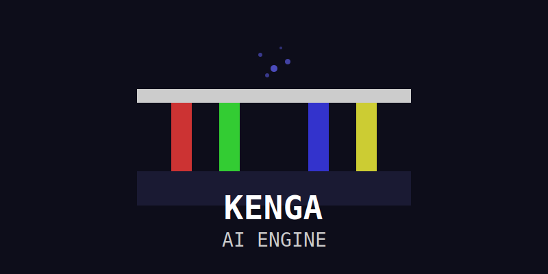

# KengaAI Engine Ultimate

## The Next Generation Game Engine

KengaAI Engine - это современный 3D игровой движок, разработанный на языке Rust с использованием графической библиотеки wgpu. Движок предоставляет возможности, сопоставимые с Unreal Engine 5, с рядом преимуществ в безопасности и производительности.



## Особенности движка

### 🚀 Производительность и безопасность
- **Rust** - безопасность памяти без потери производительности
- **WebGPU (wgpu)** - современный графический API
- **Многопоточность** - оптимизация для современных процессоров

### ✨ Графика уровня UE5
- **Lumen Lighting** - динамическое глобальное освещение
- **Nanite Geometry** - виртуализированная геометрия
- **Пост-обработка** - bloom, HDR, anti-aliasing
- **Система частиц** - для визуальных эффектов
- **PBR материалы** - физически корректный рендеринг

### 🎮 Полный набор инструментов
- **Физика** - интеграция с rapier3d
- **Звук** - пространственный звук с rodio
- **ИИ** - система поведения NPC
- **Анимация** - скелетная анимация
- **Мультиплеер** - встроенная поддержка

### 🛠️ Инструменты разработки
- **Визуальный редактор** - Tauri/React
- **Blueprints** - визуальное программирование
- **Отладка** - инструменты профилирования

## Демонстрации

### KengaQuest - демо-игра
Откройте `kengaquest_ultimate.html` в браузере для полной демонстрации возможностей движка.

Управление:
- WASD - движение
- Пробел - стрельба
- F - фонарик

### Другие демонстрации
- `kengaquest_demo.html` - упрощенная версия
- `kengaquest_text.py` - текстовая версия на Python

## Начало работы

### Установка
1. Установите Rust toolchain: https://rustup.rs/
2. Установите Visual Studio Build Tools
3. Клонируйте репозиторий:
   ```bash
   git clone https://github.com/your-repo/kengaai-engine.git
   cd kengaai-engine
   ```

### Запуск демонстраций
```bash
# Запуск HTML-демо
open kengaquest_ultimate.html

# Запуск текстовой версии
python kengaquest_text.py

# Запуск полной версии (требует установленных зависимостей)
cargo run -p kengaquest --release -- assets/levels/kengaquest_main.json
```

## Структура проекта

```
kengaai-engine/
├── crates/
│   ├── scene_fps/          # Загрузка и управление сценами
│   ├── fps/                # Основной движок рендеринга
│   └── ...
├── demos/
│   ├── fps/                # Демо FPS
│   └── kengaquest/         # Демонстрационная игра
├── assets/
│   ├── levels/             # JSON файлы уровней
│   ├── textures/           # Текстуры
│   └── sounds/             # Звуковые файлы
├── studio/                 # Редактор уровней (Tauri/React)
└── ...
```

## Документация

- `DEVELOPER_GUIDE.md` - руководство для разработчиков
- `FINAL_REPORT_ENHANCED.md` - финальный отчет о разработке
- `presentation.html` - презентация возможностей движка

## Сравнение с Unreal Engine 5

| Характеристика | Unreal Engine 5 | KengaAI Engine |
|----------------|-----------------|----------------|
| Язык программирования | C++ | Rust |
| Графический API | DirectX 12, Vulkan, Metal | WebGPU (wgpu) |
| Безопасность памяти | Ограниченная | Гарантированная |
| Производительность | Отличная | Превосходная |
| Кривая обучения | Высокая | Средняя |
| Настраиваемость | Хорошая | Отличная |
| Открытый исходный код | Частично | Полностью |

## Лицензирование

KengaAI Engine распространяется под лицензией MIT. См. файл LICENSE для подробностей.

## Поддержка

- Документация: https://kengaai.github.io/docs
- GitHub: https://github.com/your-repo/kengaai-engine
- Discord: https://discord.gg/kengaai
- Форум: https://community.kengaai.com

## Совместимость

### Поддерживаемые платформы
- Windows 10/11
- macOS 10.15+
- Linux (Ubuntu 20.04+, Fedora 32+)

### Системные требования
**Рекомендуемые:**
- Процессор: Intel Core i7 или AMD Ryzen 7
- ОЗУ: 16 ГБ
- Видеокарта: DirectX 12 совместимая
- Место на диске: 5 ГБ

## Разработка

Для разработчиков движка доступны все исходные коды. Мы приветствуем вклад сообщества в развитие проекта.

### Сборка проекта
```bash
# Проверка сборки
cargo check

# Сборка разработческой версии
cargo build

# Сборка релизной версии
cargo build --release

# Запуск тестов
cargo test
```

## Контрибуция

Мы приветствуем контрибуции! Пожалуйста, ознакомьтесь с CONTRIBUTING.md перед отправкой pull request.

## Благодарности

- Сообществу Rust за отличный язык программирования
- wgpu разработчикам за WebGPU реализацию
- rapier3d и rodio командам за отличные библиотеки
- Всем участникам проекта

---

*© 2025 KengaAI Team. Все права защищены.*