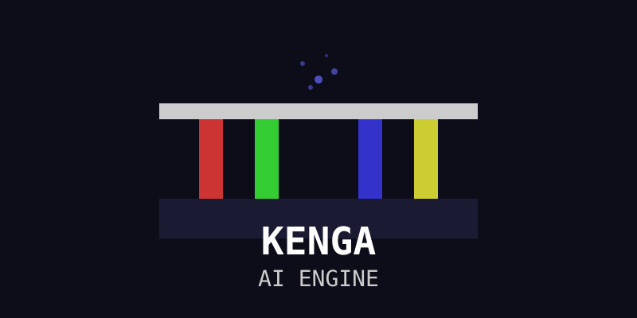

# KengaAI Engine

Современный 3D-игровой движок на Rust и wgpu, созданный для высокой производительности и безопасности.



## 🚀 Основные возможности

- **Графика**: рендеринг на wgpu (Vulkan/Metal/DX12/OpenGL), динамическое освещение, PBR-материалы (в разработке).
- **Физика**: интеграция с `rapier3d`.
- **Звук**: пространственный звук через `rodio`.
- **Кроссплатформенность**: поддержка Windows, Linux, macOS.
- **Безопасность**: безопасность памяти благодаря Rust.

## 🛠️ Состав проекта

- `crates/`: исходный код движка, разделенный на модули (крейты).
  - `fps/`: основной модуль рендеринга.
  - `scene_fps/`: загрузка и управление сценами в формате JSON.
  - `model_loader/`: загрузчик 3D-моделей (например, `.obj`).
- `demos/`: примеры использования движка.
  - `kengaai-demo-fps`: демонстрация FPS-механик.
  - `kengaquest`: небольшая демо-игра.
- `studio/`: нативное приложение-редактор уровней на Tauri и React.
- `assets/`: игровые ресурсы (3D-модели, текстуры, уровни).

## 🖥️ Системные требования

### Минимальные:
- **ОС**: ALT Linux 11+, Ubuntu 22.04+, Windows 10/11
- **Процессор**: x86-64 с поддержкой SSE4.2
- **Память**: 8GB RAM
- **Графика**: GPU с поддержкой Vulkan 1.1+ или OpenGL 4.3+ (NVIDIA GTX 1050 / AMD RX 550)

### Рекомендуемые:
- **Графика**: NVIDIA RTX 3060 / AMD RX 6600 или лучше
- **Память**: 16GB+ RAM

## ⚙️ Установка и запуск (ALT Linux)

### 1. Установка системных зависимостей

```bash
# Для движка (wgpu, winit, rodio)
sudo apt-get install -y libX11-devel libXcursor-devel libXi-devel libXrandr-devel libxkbcommon-devel libalsa-devel vulkan-loader-devel

# Для нативной студии (Tauri)
sudo apt-get install -y pkg-config gcc make glib2-devel libgtk+3-devel libwebkit2gtk4.1-devel libjavascriptcoregtk4.1-devel libcairo-devel libpango-devel libgdk-pixbuf-devel libatk-devel libappindicator-devel
```

### 2. Установка Rust
Рекомендуется использовать `rustup`:
```bash
curl --proto '=https' --tlsv1.2 -sSf https://sh.rustup.rs | sh
source "$HOME/.cargo/env"
rustup component add rust-src # для rust-analyzer
```
Если `rustup` недоступен, установите из репозитория: `sudo apt-get install rust rust-cargo rust-src`.

### 3. Сборка и запуск

```bash
# Клонирование репозитория
git clone https://github.com/your-repo/kengaai-engine.git
cd kengaai-engine

# Сборка проекта
cargo build --release

# Запуск FPS-демо
cargo run --release -p kengaai-demo-fps
```

##  studio: Нативный редактор уровней

Студия — это отдельное десктоп-приложение для создания и редактирования JSON-файлов уровней.

### Запуск в режиме разработки

```bash
# Установка зависимостей и запуск UI
cd studio
npm install

# В первом терминале: запустить Vite dev server
npm run dev

# Во втором терминале: запустить Tauri
npm run tauri:dev
```

## 🤝 Вклад в проект

Мы приветствуем любой вклад! Пожалуйста, ознакомьтесь с `DEVELOPER_GUIDE.md` и создавайте Pull Request'ы.

---
*© 2025 KengaAI Team*